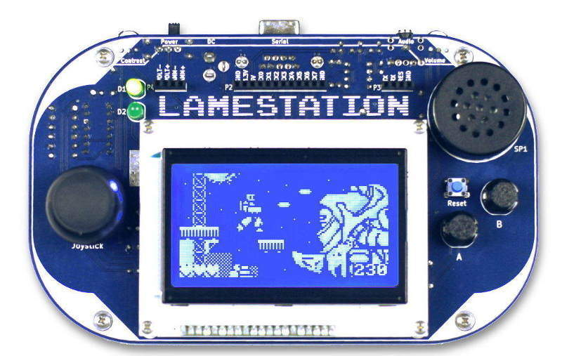

# Introduction

This book will teach you about the LameStation: how to turn it on, what makes it tick, and how to use it for world domination... or maybe just to make some games.

The LameStation is powered by the Parallax Propeller, a microcontroller developed almost entirely by one person, Chip Gracey, over the course of seven years. I mean, seriously, how awesome is that!

A microcontroller is a computer, like a laptop or desktop, but smaller and less powerful. It is their size that makes them useful; microcontrollers can go places regular computers just can't go, like in TVs, microwaves, phones, cars, and much more.

Game consoles are insanely complicated. While nothing in life comes easy, that doesn't mean it has to be boring. I made the LameStation so that I could share in the epic educational experience that was developing the thing. Truly, making something yourself is one of the greatest joys in life, and I challenge you to create something all your own with the LameStation. :)
