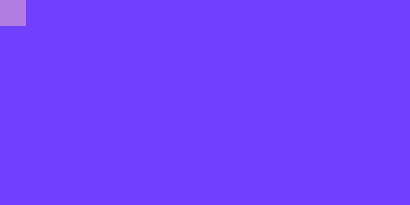
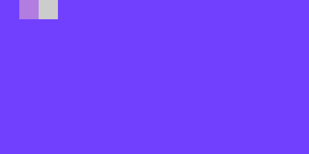
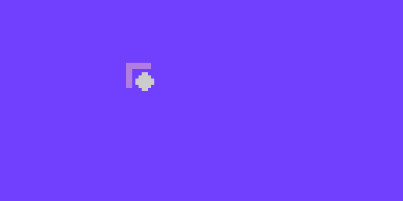
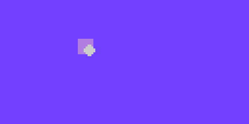

= Colors

So far you've been introduced to black and white, but there are two other colors you can work with that are very important.

== Gray

LameStation supports two more color choices other than plain black and white:
the first of these is gray.

===  Increasing the clock speed

Up until now, you've only been using the LameStation at a reduced speed. As it
turns out, it can go much faster, and you're gonna need to crank it up in
order to use the gray feature.

Adding this code to the beginning of your file tells the Propeller to use the
external crystal oscillator and how fast it should run.

----   
CON
    _clkmode = xtal1|pll16x
    _xinfreq = 5_000_000
----

===  Enabling gray pixels

Here's how to write a block of gray in the LameStation sprite format.

----
word    %%33333333
word    %%33333333
word    %%33333333
word    %%33333333
word    %%33333333
word    %%33333333
word    %%33333333
word    %%33333333
----

You may be wondering why the pixels suddenly consist of 3s. This has more to
do with how the LameStation works than anything else.

The LameStation has a black and white screen, so it takes some trickery to get
it to show gray. There are 16 bits for every 8 pixels, but so far, we've only
used about half of them.

----
%%11111111 == %01_01_01_01_01_01_01_01
----

Here's what the two bits in every pixel do:

- The 1s here are what we call the "color" bits. They tell the LameStation whether or not a pixel should turn on ever. 
- The 0s here are the "flip" bits. They tell the LameStation that if a pixel is on, keep it off half the time. 

That means if a pixel's color bit and flip bit are turned on, it will continuously turn on and off, which appears gray to the human eye. How cool is that!

See it in action.

.Gray.spin
----
CON
    _clkmode = xtal1|pll16x
    _xinfreq = 5_000_000

OBJ
    lcd : "LameLCD"
    gfx : "LameGFX"

PUB Main
    lcd.Start(gfx.Start)
    gfx.Sprite(@data, 0, 0, 0)
    lcd.DrawScreen

DAT

data
word    0
word    8, 8
word    %%33333333
word    %%33333333
word    %%33333333
word    %%33333333
word    %%33333333
word    %%33333333
word    %%33333333
word    %%33333333
----

.Beware
****
Make sure you check the [ contrast knob ](16547914.adoc) settings! If it's set
too low or too high, the gray color may end up appearing black or white. If
it's set just right, you will get the gray you're looking for.
****

Since gray can be hard to see by itself, let's see it alongside black and
white to make it more visible.

.Colors.spin
----
CON
    _clkmode = xtal1|pll16x
    _xinfreq = 5_000_000

OBJ
    lcd : "LameLCD"
    gfx : "LameGFX"

PUB Main
    lcd.Start(gfx.Start)
    gfx.Sprite(@black, 0, 0, 0)
    gfx.Sprite(@gray, 8, 0, 0)
    gfx.Sprite(@white, 16, 0, 0)
    lcd.DrawScreen

DAT

black
word    0
word    8, 8
word    %%00000000
word    %%00000000
word    %%00000000
word    %%00000000
word    %%00000000
word    %%00000000
word    %%00000000
word    %%00000000

white
word    0
word    8, 8
word    %%11111111
word    %%11111111
word    %%11111111
word    %%11111111
word    %%11111111
word    %%11111111
word    %%11111111
word    %%11111111

gray
word    0
word    8, 8
word    %%33333333
word    %%33333333
word    %%33333333
word    %%33333333
word    %%33333333
word    %%33333333
word    %%33333333
word    %%33333333
----

.Think It Over
****
_Question 1: What would happen if we tried running the previous example **
without ** increasing the clock speed?_

Instead of gray, you'll be looking at a blinking white box. Gray is enabled,
but the processor is running far too slowly to drive the LCD and produce the
gray effect.

That's why, in general, you're _**always**_ going to want to run the
LameStation at full speed off the external oscillator. It's literally
thousands of times faster than the internal oscillator and gives you the power
to run real games with real performance.

== Transparency

There's one other "color" that you can use, if you want to call it that.
Here's what a block of  _transparency_ looks in the sprite format.

----
word    %%22222222
word    %%22222222
word    %%22222222
word    %%22222222
word    %%22222222
word    %%22222222
word    %%22222222
word    %%22222222
----

We won't even bother trying to run it though because, well... you won't be
able to see it!

===  How Does It Work?

If you were paying attention to the explanation of color bits and flip bits (I
can understand if you weren't), you may have noticed something interesting. If
00 equals black, 01 equals white, and 11 equals gray, what does 10 equal? What
happens when the flip bit is enabled but the color is off?

Well, nothing happens, and it wouldn't make sense if something did. So we
decided to do something useful with that extra "color", and use it for
transparency. The best way to show what this draws is by showing what it
doesn't draw.

Here is a drawing of a ball on top of a square.

.BallWithoutTransparency.spin
----
CON
    _clkmode = xtal1|pll16x
    _xinfreq = 5_000_000

OBJ
    lcd : "LameLCD"
    gfx : "LameGFX"

PUB Main
    lcd.Start(gfx.Start)
    gfx.Sprite(@box, 40, 20, 0)
    gfx.Sprite(@ball, 42, 22, 0)
    lcd.DrawScreen

DAT

box
word    0
word    8, 8
word    %%33333333
word    %%33333333
word    %%33333333
word    %%33333333
word    %%33333333
word    %%33333333
word    %%33333333
word    %%33333333

ball
word    0
word    8, 8
word    %%00000000
word    %%00011000
word    %%00111100
word    %%01111110
word    %%01111110
word    %%00111100
word    %%00011000
word    %%00000000
----

Here's what it looks like. The first thing you notice is that the ball
completely obstructs the square.

Here is the same example again, but with the ball image modified to use
transparency.

.BallWithTransparency.spin
----
CON
    _clkmode = xtal1|pll16x
    _xinfreq = 5_000_000

OBJ
    lcd : "LameLCD"
    gfx : "LameGFX"

PUB Main
    lcd.Start(gfx.Start)
    gfx.Sprite(@box, 40, 20, 0)
    gfx.Sprite(@ball, 42, 22, 0)
    lcd.DrawScreen

DAT

box
word    0
word    8, 8
word    %%33333333
word    %%33333333
word    %%33333333
word    %%33333333
word    %%33333333
word    %%33333333
word    %%33333333
word    %%33333333

ball
word    0
word    8, 8
word    %%22222222
word    %%22211222
word    %%22111122
word    %%21111112
word    %%21111112
word    %%22111122
word    %%22211222
word    %%22222222
----

Now it actually looks like a ball in front of a square instead of a random
square thing in front of a square.

And voila, that's transparency!

.Think It Over
****
_Question 1: How does LameGFX actually transparent pixels? How does
this work?_

When LameGFX encounters a transparent picture, it simply ignores it. There's
no drawing involved.