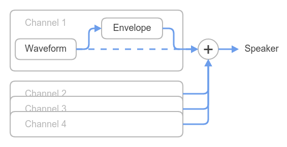
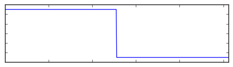
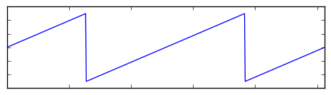
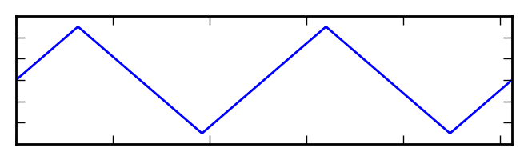
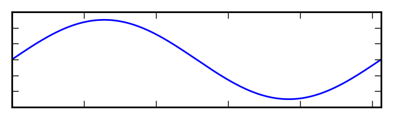
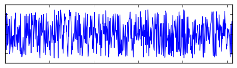
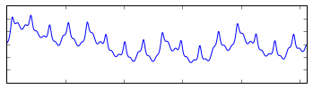
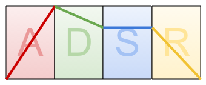

== LameAudio

LameAudio is a 4-channel synthesizer for the LameStation.

[source, language='obj']
----
audio : "LameAudio"
----

Demos for this object can be found in the `/demos/audio/` folder of the SDK.

=== Commands

- `audio.Start` - Initialize the LameAudio synthesizer.
- `audio.SetEnvelope` - Toggle the ADSR envelope generator on the given audio channel.
- `audio.StopAllSound` - Stop sound on all channels.

*Sound Shaping Commands*

- `audio.SetParam` - Manually set a parameter of the audio channel.
- `audio.SetADSR` - Set all parameters of the ADSR envelope shape.
- `audio.SetWaveform` - Set the waveform of the given audio channel.
- `audio.SetSample` - Load a new sample.
- `audio.LoadPatch` - Load a complete patch configuration to any channel(s).

*Keyboard Mode Commands*

- `audio.PlaySound` - Play a sound on the specified channel.
- `audio.StopSound` - Stop sound on the specified channel.

*Manual Mode Commands*

- `audio.SetVolume` - Set the volume of the target note.
- `audio.SetNote` - Set the note of the given audio channel.
- `audio.SetFrequency` - Set the frequency increment of the specified audio channel.
- `audio.StartEnvelope` - Trigger the channel envelope to start.
- `audio.StopEnvelope` - Trigger the channel envelope to stop.

=== Constants

- *Waveform* - `_SQUARE`, `_SAW`, `_TRIANGLE`, `_SINE`, `_NOISE`, `_SAMPLE`
- *Channel parameter* - `_ATK`, `_DEC`, `_SUS`, `_REL`, `_WAV`, `_CONTROL`

=== About

Before LameAudio can be used, `audio.Start` must be called once and only once at the start of a program. LameAudio is designed so that only one synthesizer is ever running, and any object may call it.

Each channel has its own parameters that affect the sound it makes. `audio.SetParam` can control any parameter in the _Channel parameter_ constant list. You can change all parameters at once with the `audio.LoadPatch` command, which is good if you change instruments often.

This is what a patch looks like.

[source]
----
DAT
    patch
    byte  $F, 127, 10, 100, 10, audio#_SAW
----

Each channel has a waveform and an envelope.

==== Waveform

The waveform generator is what actually creates the sound. Call `audio.SetFrequency` to play any frequency, or call `audio.SetNote` to play specific notes like on a piano.

Call `audio.SetWaveform` to load one of the following waveforms.

.Waveforms
|===
| *Value* | *Name*   | *Waveform*
| 0       | Square   | 
| 1       | Sawtooth | 
| 2       | Triangle | 
| 3       | Sine     | 
| 4       | Noise    | 
| 5       | Sample   | 
|===

The _Sample_ waveform is a 512B block of audio data, enough for one cycle. Call `audio.SetSample` with the address of a sample to load it. Only one sample can be used at a time.

A collection of ready-made samples can be found in the `/media/samples/` folder of the SDK.

==== Envelope

The envelope controls the volume of the sound over time, allowing you to create sounds that hit sharply like bells, or have a long hold time like a wind instrument. You can control how it sounds with the ADSR parameters of the envelope.

_ADSR_ stands for _Attack, Decay, Sustain, and Release_. You can configure ADSR settings with `audio.SetADSR`.

- *Attack* (`0-127`) - The time from silence to full volume.
- *Decay* (`0-127`) - The time from the max value to...
- *Sustain* (`0-127`) - The volume at which the note is held while pressed.
- *Release* (`0-127`) - The time from sustain to silence.

The envelope can be toggled with `audio.SetEnvelope`.

- If enabled, you can play and stop notes with the `audio.PlaySound` and `audio.StopSound` commands.

- If disabled, you can control channel volume manually using `audio.SetVolume`, which is useful for creating sound effects. You can also manually start and stop the envelope with `audio.StartEnvelope` and `audio.StopEnvelope`.

To silence all audio, use the `audio.StopAllSound` command.

=== Sample Format

LameStation songs consist of two main sections: pattern and sequence data.

==== Sample Data

A LameAudio sample is a 512-byte sequence of arbitrary data. It can be anything you want as long as its 512 bytes.

[source]
.Example pattern section
----
DAT
wav_data

byte    <512 bytes...>
----

Since it's possible to use any address in memory, the running system can also create samples on the fly.

==== Sample Interface

The address of sample data can be passed directly to `audio.SetSample`, unless stored in another object. If so, use this interface:

[source]
----
PUB Addr
    return @wav_data
----
