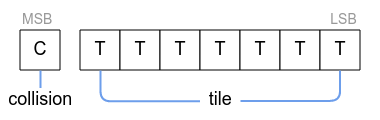

= LameGFX

image:Blit.png[]

LameGFX provides a hyper-speed drawing engine for LameStation graphics. It is the foundation of all other LameStation graphics.

----
gfx : "LameGFX"
----

Demos for this object can be found in the `/demos/graphics/` folder of the SDK.

== Commands

- `gfx.Start` - Initialize the LameGFX drawing library.
- `gfx.Clear` - Clear the screen to black.
- `gfx.Fill` - Fill the screen with a repeating word `color`.
- `gfx.Blit` - Draw a screen-sized image at (0,0).
- `gfx.Sprite` - Draw an image of any size to (x,y).
- `gfx.Map` - Draw a tile-based level map.
- `gfx.InvertColor` - Invert black and white pixels sprite drawing.

*Advanced Commands*

- `gfx.SetClipRectangle` - Change the portion of the screen that will be drawn to by LameGFX.
- `gfx.WaitToDraw` - Wait until the last drawing operation has completed before continuing.

== Constants

- `BLACK`, `GRAY`, `WHITE`, `TRANSPARENT` - predefined colors for filling the screen with `gfx.Fill`.
- `SCREEN_W`, `SCREEN_H` - the width and height of the screen.

== About

Call `gfx.Start` to start LameGFX. It should only be started once at the beginning of your program, before all drawing operations, and should be connected to LameLCD right away.

----
PUB
    lcd.Start(gfx.Start)
----

Clear the screen to black with `gfx.Clear`, or fill to any color with `gfx.Fill`.

Call `gfx.Sprite` to draw images to the screen. If an image is exactly 128x64 pixels, use `gfx.Blit` for much faster drawing.

Use `gfx.Map` to draw level maps directly, or you can use LameMap for more functionality.

`gfx.InvertColor` changes all black pixels to white, and vice versa. This is useful as a cool effect or reusing graphics.

=== Advanced Usage

==== Clipping

LameGFX supports clipping, which allows you to limit the part of the screen that functions will draw to. This is useful if, for example, you want to show half of an image, or a progress bar that can fill up.

Call `gfx.SetClipRectangle` to set the clipping region, which is a rectangle from (0,0) to (128,64) by default. It will remain that size until you reset it to its normal size.

The first point is inclusive, while the second is exclusive. That means that a region of (0, 0, 128, 64) allows you to draw on pixels from (0,0) to (127,63).

[NOTE]
The second point must be to the right and down relative to the first, otherwise the clip rectangle will be of size (0,0), or not drawable.

==== Direct Drawing

You can draw to the LameGFX buffer directly. First, you must enable access. This is done by grabbing its address during setup.

----
VAR
    word    buffer
PUB
    lcd.Start(buffer := gfx.Start)
----

You can now access the 2048-byte block of memory pointed to by `buffer`.

LameGFX will wait until the previous drawing command is finished before starting a new one. However, advanced users may want to create their own drawing functions. If so, use `gfx.WaitToDraw` to ensure your function plays well with LameGFX.

== Sprite Format

=== Sprite Data

Map data is raw data describing what an area looks like and how the player can interact with it.

- *frameboost* - T
- *width*, *height* (`0-65535`) - The width and height of the image in tiles.
- *tile* - The array of tiles that make up this level, placed left-to-right, top-to-bottom.
----
DAT
map_data

word    <width>, <height>

byte    <tile>, [<tile>]...
----

Each tile in a map is one byte, with 1 bit used for collision, and the other 7 used for the tile number footnote:[Collision data is stored in the level to save space and allow for hidden passageways.].

Tile 0 is used as a _null_ tile, so the maximum usable tilemap size is 126 tiles.

The collision bit stores whether a tile will register a collision when touched. All collision functions return 0 unless this bit is set.

=== Sprite Interface

The address of image data can be passed directly to `gfx.Sprite` and `gfx.Blit`, unless stored in another object. If so, use this interface:

----
PUB Addr
    return @gfx_data
----