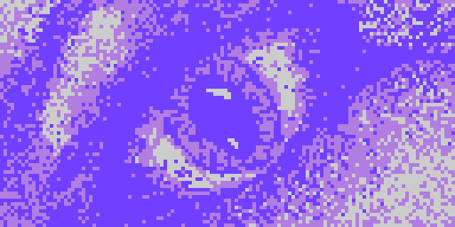

= LameGFX

LameGFX provides a hyper-speed drawing engine for LameStation graphics.

----
gfx : "LameGFX"
----

Demos for this object can be found in the `/demos/graphics/` folder of the SDK.

== Commands

- `gfx.Start` - Initialize the LameGFX drawing library.
- `gfx.Clear` - Clear the screen to black.
- `gfx.Fill` - Fill the screen with a repeating word `color`.
- `gfx.Blit` - Draw a screen-sized image at (0,0).
- `gfx.Sprite` - Draw an image of any size to (x,y).
- `gfx.Map` - Draw a tile-based level map.
- `gfx.InvertColor` - Invert black and white pixels sprite drawing.
- `gfx.SetClipRectangle` - Change the portion of the screen that will be drawn to by LameGFX.
- `gfx.WaitToDraw` - Wait until the last drawing operation has completed before continuing.

== About
