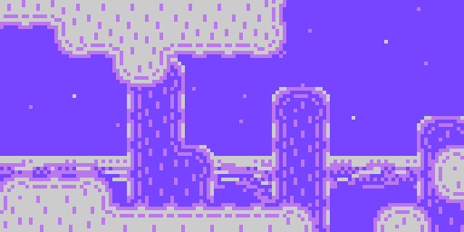
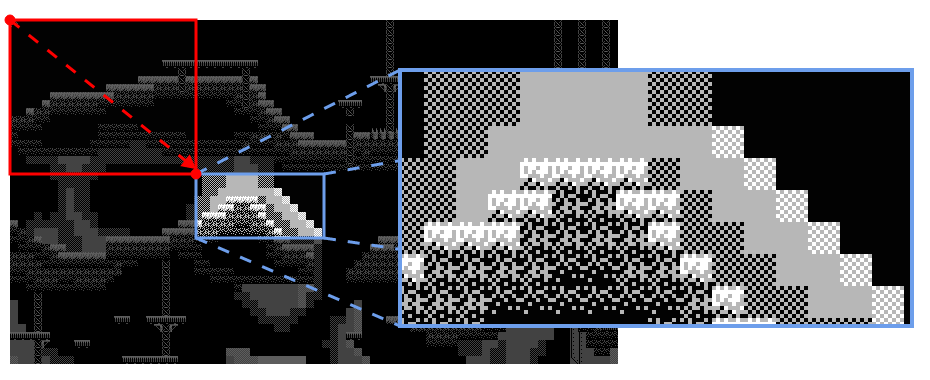
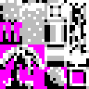
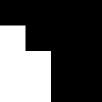
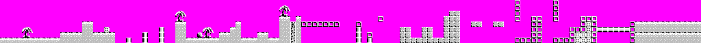

= LameMap

LameMap is a tile engine for LameGFX. It provides functions to display and interact with tile-based game maps.

== Commands

- `map.Load` - Load a map into LameMap.
- `map.Draw` - Draw the current map to the screen.
- `map.DrawRectangle` - Draw the current map to a portion of the screen.
- `map.Width` - Return the width of the currently loaded map in tiles.
- `map.Height` - Return the height of the currently loaded map in tiles.
- `map.TestPoint` - Test whether tile on a map is collidable.
- `map.TestCollision` - Test if the region has collided with a map tile.
- `map.TestMoveX` - Apply horizontal movement to an object's position and test if it will collide.
- `map.TestMoveY` - Apply vertical movement to an object's position and test if it will collide.

== About

LameGFX must be started before LameMap can be used. Call `map.Load` to load a map. Only one map can be loaded at a time.

There are two ways to draw a map to the screen: `map.Draw` draws the map to the whole screen, while `map.DrawRectangle` limits the map to a region with the corners (x1, y1) and (x2, y2). Both use an `offset_x` and `offset_y` that determine which portion of the map to show.

You can get the number of horizontal and vertical tiles in your map with `map.Width` and `map.Height`.

----
mapsize := map.Width * map.Height
----

LameMap has collision support built in. `map.TestPoint` returns if a tile has collision enabled. You can test whether or not collision has occurred with `map.TestCollision`, passing the rectangle of the object.

Knowing whether a collision has happened is often not enough, as you might need to keep the playing inside a known region. `map.TestMoveX` and `map.TestMoveY` allow you to test if a collision has occurred horizontally or vertically. If it has, it will return a correction factor to add to the object's position to remove it from the collision. In this way, you can build walls that your players can't escape from.

== Map Format

Game maps consist of three parts: a tile map, a level map, and an optional collision map.

- A *tile map* is a 2D array of sprites intended for creating maps. They are carefully organized so that they can be indexed one-by-one. On LameStation, a tile map is just an ordinary sprite with frames.
+

- A *collision map* mirrors the tile map and provides information about which tiles can be walked on and which ones can't. A black square cannot be walked on, while a white one can.
+

- A *level map* combines the data in the tile map and collision map to build a space that can be navigated as part of the gameplay.
+

=== Level Map Data

Map data is raw data describing what an area looks like and how the player can interact with it.

- *width*, *height* (`0-65535`) - The width and height of the image in tiles.
- *tile* - The array of tiles that make up this level, placed left-to-right, top-to-bottom.
----
DAT
map_data

word    <width>, <height>

byte    <tile>, [<tile>]...
----

Each tile in a map is one byte, with 1 bit used for collision, and the other 7 used for the tile number footnote:[Collision data is stored in the level to save space and allow for hidden passageways.].

image:tilebyte.png[]

Tile 0 is used as a _null_ tile, so the maximum usable tilemap size is 126 tiles.

The collision bit stores whether a tile will register a collision when touched. All collision functions return 0 unless this bit is set.

The address of the map data can be passed directly to `map.Load`, unless stored in another object. If so, the following function is used as an interface.

----
PUB Addr
    return @map_data
----