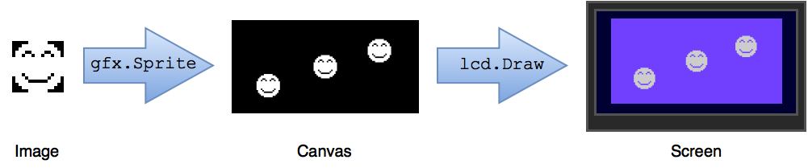

== Humble beginnings

In the previous section, we showed you how to set up a basic Spin template, but you still haven't seen it do anything.

Now that that's out of the way, let's do something. Here's a lofty goal: let's make the LameStation draw something.

There are three steps to using graphics in a program.

. Add graphics data to your program
. Use  to draw screen image
. Send image to actual screen

=== Instructions

==== Add graphics for drawing

So here's how we can add graphics. Since snake is just a dot, that's all we need.

[source, hl_lines="2,3"]
----
DAT
    dot_gfx
    word    0
    word    2, 2
    word    %%11
    word    %%11
----

[WARNING]
====
Due to a temporary bug in LameGFX, you'll need to use this graphic for the dot.

----
DAT
    dot_gfx
    word    0
    word    2, 2
    word    %%22222211
    word    %%22222211
----

This is because there's no such thing as a graphic 2 pixels wide on the LameStation, but LameGFX is filling it with black instead of transparent.
====

==== Use graphics to draw screen image

Drawing is done with the `gfx.Sprite` command. It has four arguments, which control how it will behave.

.gfx.Sprite
****
> ----
> gfx.Sprite(source, x, y, frame)
> ----

- *source* - the graphics to draw
- *x*, *y* - the position of the graphics (top-left corner)
- *frame* - the number of frames
****

So the source should be the address of the graphics we made before. 

The screen is 128x64 pixels, so you have to draw the dot between (0,0) and (128,64) for it to be visible. Other than that, we don't really care where it shows up yet.

We're not using the frame parameter yet, so just set it to zero.

----
    gfx.Sprite(@dot_gfx, 25, 25, 0)
----

==== Send the image to the screen

If you try running it now, you still won't see anything. You need `lcd.Draw` to actually draw to the screen.

----
    lcd.Draw
----

[WARNING]
.`dot_gfx` does not equal `@dot_gfx`.
====

'@' is the address operator, and it changes the meaning of a variable or label.

- `dot_gfx` is the value at `dot_gfx`.
- `@dot_gfx` is the address of `dot_gfx`, or where it is in memory.

See for yourself. Try removing the '@' symbol from your code and see what happens.
====

At this point, you should have a very exciting dot on the screen.

View the complete example at `/tutorials/Snake/HumbleBeginnings.spin`.

=== Recap

In this section, you learned how to:

- Create ultra basic graphics
- Draw graphics to the screen buffer
- Update the screen

=== Think about this!

. What happens if you try to draw graphics off the screen?

. You've seen how to draw one. How could you draw more than one to the screen?

=== Feeling Adventurous?

. Instead of passing `@dot_gfx` to `gfx.Sprite`, try just passing zero. What do you see? What do you think it means?

// you're looking at your actual program being printed to the screen