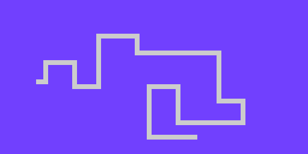

== Leading The March
:experimental:

In Snake, for every frame, the snake moves forward one pixel, with each pixel following after it.

----
■ ■ ■ ■ ■           ' frame 1
  ■ ■ ■ ■ ■         ' frame 2
    ■ ■ ■ ■ ■       ' frame 3
----

So how do we emulate that? We basically need to do everything we've done up to this point, times however long the snake is. Two bytes for x and y clearly won't be enough. We're going to need arrays.

=== Instructions

==== Maximum snake!

We need to define an array, but first, let's add a constant for the maximum number of snakes. This is important, because without it, it's chaos trying to remember how many are allowed throughout your program.

First, decide how long the snake can be. We need to know how big to make the arrays. 256 seems pretty big, but on a 128x64 screen, there are *8192 pixels*!

[source, language='con']
.Snake.spin
----
    RIGHT = 1
    DOWN  = 2
    LEFT  = 3
    
+++    MAX_LENGTH = 256

OBJ
    lcd  : "LameLCD"
----

We need to turn our `snakex` and `snakey` variables into arrays.

[source, language='obj']
.Snake.spin
----
    ctrl : "LameControl"
    
VAR
***    byte    snakex[MAX_LENGTH]
***    byte    snakey[MAX_LENGTH]

    byte    snakedir
----

We now need to update the syntax of every `snakex` and `snakey`. Find (kbd:[Ctrl+F]) is the fastest way to make this happen.

[WARNING]
====
Make sure you replace all instances of `snakex` with `snakex[0]` and `snakey` with `snakey[0]`. E.g.:

[source, language='pub']
----
    snakex[0] := 32
    snakey[0] := 32
----

Don't accidentally replace your array declaration:

[source, language='var']
----
    byte    snakex[0][MAX_LENGTH]
    byte    snakey[0][MAX_LENGTH]
----
====

==== How much is too much?

Since the snake starts small and grows, we also need to keep track of how many snake dots there are on the screen at any time. So we'll create `snakecount`. Byte-sized is fine, since `MAX_LENGTH` is 256.

[source, language='var']
.Snake.spin
----
VAR
    byte    snakex[MAX_LENGTH]
    byte    snakey[MAX_LENGTH]

    byte    snakedir
+++    byte    snakecount

PUB Main
    lcd.Start(gfx.Start)
----

Since we start with 1 pixel, we'll set `snakecount` to 1 at startup.

[source, language='pub']
.Snake.spin
----
    snakey[0] := 32
    snakedir := 1
+++    snakecount := 1
    
    repeat
        gfx.Clear
----

We're going to add a variable `i`. This one is just used for a `repeat` loop.

[source, language='var']
.Snake.spin
----
    byte    snakedir
    byte    snakecount

+++    byte    i

PUB Main
    lcd.Start(gfx.Start)
----

==== Lining them up

What we need to do is make each and every dot follow the one that came before it in a line. That's easy enough. The position of the next position should equal the position of the last.

[source, language='pub']
.Snake.spin
----
snakex[i] := snakex[i-1]
----

So how do we go over all the points of the snake so that this will work? There's two options:

===== Option 1: Front to back

We start from the front of the snake and go to the end.

`repeat i from 1 to snakecount`

If we run these commands in order:

----
snakex[1] = snakex[0]
snakex[2] = snakex[1]
snakex[3] = snakex[2]
----

This doesn't work. When you simplify it, you end up with this:

----
snakex[3] = snakex[2] = snakex[1] = snakex[0]
----

In other words, a single dot. Lame.

===== Option 2: Back to front

We can also try starting from the back of the snake and going to the front.

`repeat i from snakecount to 1`

You'll see that running it this way yields the result we want.

----
snakex[3] = snakex[2]
snakex[2] = snakex[1]
snakex[1] = snakex[0]
----

In other words, `snakex[3]` is the old value of `snakex[2]`, `snakex[2]` is the old value of `snakex[1]`, and `snakex[1]` is the old value of `snakex[0]`.

Well, gee, that's just what we want!

There is only one value that isn't set this way, and that's `snakex[0]`. That's okay though, because we already set `snakex[0]` via player direction.

Here's the code that calculates the locations of the snake's tail. We should place this code after drawing the first snake sprite but before `lcd.Draw`.

[source, language='pub']
.Snake.spin
----
        if snakedir == DOWN and snakey[0] < constant(64-2)
            snakey[0]++
            
        gfx.Sprite(@dot_gfx, snakex[0], snakey[0], 0)        

+++        repeat i from snakecount to 1
+++            snakex[i] := snakex[i-1]
+++            snakey[i] := snakey[i-1]
            
        lcd.Draw
    
DAT
    dot_gfx
----

Don't forget, though. We also want to _see_ the tail, so make sure to include a call to `gfx.Sprite` to draw the tail at each position.

[source, language='pub']
.Snake.spin
----
        gfx.Sprite(@dot_gfx, snakex[0], snakey[0], 0)        

        repeat i from snakecount to 1
            snakex[i] := snakex[i-1]
            snakey[i] := snakey[i-1]
+++            gfx.Sprite(@dot_gfx, snakex[i], snakey[i], 0)
            
        lcd.Draw
----

In essence, we now have a snake, not just a single dot, that can move around the field.

==== Growing up fast

Before we can see it in action, the tail has to get longer. Now, we could make the tail longer at startup, but that's harder and requires extra code.

For now, let's just add a little snippet to increase the tail length one by one, which is close to how it'll work when the game is finished anyway. You can put it anywhere in the loop, but I choose to group it with all the other controls.

[source, language='pub']
.Snake.spin
----
    repeat
        gfx.Clear
        ctrl.Update

+++        if ctrl.A
+++            if snakecount < constant(MAX_LENGTH-1)
+++                snakecount++

        if snakedir == LEFT or snakedir == RIGHT
----

Now your snake is bigger and stronger than ever before!

=== The Code

[source]
----
CON
    _clkmode = xtal1 + pll16x
    _xinfreq = 5_000_000

    UP    = 0
    RIGHT = 1
    DOWN  = 2
    LEFT  = 3
    
    MAX_LENGTH = 256

OBJ
    lcd  : "LameLCD"
    gfx  : "LameGFX"
    ctrl : "LameControl"
    
VAR
    byte    snakex[MAX_LENGTH]
    byte    snakey[MAX_LENGTH]

    byte    snakedir
    byte    snakecount

    byte    i

PUB Main
    lcd.Start(gfx.Start)
    ctrl.Start
    
    snakex[0] := 32
    snakey[0] := 32
    snakedir := 1
    snakecount := 1
    
    repeat
        gfx.Clear
        ctrl.Update

        if ctrl.A
            if snakecount < constant(MAX_LENGTH-1)
                snakecount++

        if snakedir == LEFT or snakedir == RIGHT
            if ctrl.Up
                snakedir := UP
            if ctrl.Down
                snakedir := DOWN
                
        elseif snakedir == DOWN or snakedir == UP
            if ctrl.Left
                snakedir := LEFT
            if ctrl.Right
                snakedir := RIGHT
        
        if snakedir == LEFT and snakex[0] > 0
            snakex[0]--
        if snakedir == RIGHT and snakex[0] < constant(128-2)
            snakex[0]++
        if snakedir == UP and snakey[0] > 0
            snakey[0]--
        if snakedir == DOWN and snakey[0] < constant(64-2)
            snakey[0]++
            
        gfx.Sprite(@dot_gfx, snakex[0], snakey[0], 0)        

        repeat i from snakecount to 1
            snakex[i] := snakex[i-1]
            snakey[i] := snakey[i-1]
            gfx.Sprite(@dot_gfx, snakex[i], snakey[i], 0) 
            
        lcd.Draw
    
DAT
    dot_gfx
    word    0
    word    2, 2
    word    %%22222211
    word    %%22222211
----

View this example at `/tutorials/Snake/LeadingTheMarch.spin`.

=== Think about this!

. I mentioned that you could make the tail longer at startup, so that it wouldn't just start as a dot. How would you do that?
