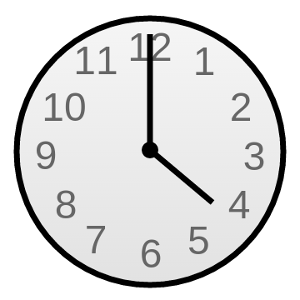

== A New Direction

The snake has a direction associated with it, so we need a way of keeping track of that direction.

A simple way to do that is by assigning a number to each direction. Because we're sane human beings, let's come up with a scheme that's easy to remember. Clock-wise is easy enough.

|===
| Direction | Number | Clock Position
| Up | 0 | 12:00
| Right | 1 | 3:00
| Down | 2 | 6:00
| Left | 3 | 9:00
|===

We can even create constants so that we don't have to remember them.

----
CON
    UP    = 0
    RIGHT = 1
    DOWN  = 2
    LEFT  = 3
----

Whatever helps you remember...

----
CON
    NORTH = 0
    EAST  = 1
    SOUTH = 2
    WEST  = 3
----

Track that number in a variable. There are only four directions, so byte-sized is plenty large.

----
VAR    
    byte    snakedir
----

Now we want to change the snake's direction with `snakedir`.

First, add code that will set `snakedir`.

----
        if ctrl.Up
            snakedir := 0
        elseif ctrl.Right
            snakedir := 1
        elseif ctrl.Down
            snakedir := 2
        elseif ctrl.Left
            snakedir := 3
----

----
        if snakedir == 0 or snakedir == 2
            if ctrl.Left
                snakedir := 3
            elseif ctrl.Right
                snakedir := 1

        elseif snakedir == 1 or snakedir == 3
            if ctrl.Up
                snakedir := 0
            elseif ctrl.Down
                snakedir := 2
----

----
        if snakedir == 3
            snakex--
                
        if snakedir == 1
            snakex++

        if snakedir == 0
            snakey--
                
        if snakedir == 2
            snakey++
----

This is cool, except the snake is able to just wander outside of the screen whenever it feels like! Let's show that snake who's boss by keeping it inside the screen.
----
        if snakedir == 3
            if snakex[0] > 0
                snakex[0]--
                
        if snakedir == 1
            if snakex[0] < constant(128-2)
                snakex[0]++

        if snakedir == 0
            if snakey[0] > 0
                snakey[0]--
                
        if snakedir == 2
            if snakey[0] < constant(64-2)
                snakey[0]++
----