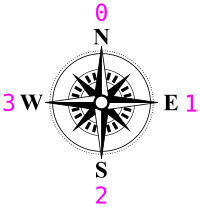

== A New Direction

In the last section, we got the dot to move around the screen based on our joystick input, and prevented it from going outside the screen.

Now, we want to introduce some actual game behaviors. If you've ever played Snake, what makes it difficult is that the snake is always moving, whether you're pressing on the controls or not. You can achieve this is by giving the snake a _direction_. 

=== Instructions

==== Left And Right

The snake is always moving in one direction, and we need to remember which direction that is.

An easy way to do that is by assigning a number to each direction. Because we're sane human beings, let's come up with a scheme that's easy to remember. Let's use a compass as a reference, and assign 0 to North, 1 to East, 2 to South, and 3 to West.

We can then create constants to make working with direction easier. Add them to our `CON` block from before.

[source]
.Snake.spin
----
CON
    _clkmode = xtal1 + pll16x
    _xinfreq = 5_000_000

&&&    UP    = 0
&&&    RIGHT = 1
&&&    DOWN  = 2
&&&    LEFT  = 3
----

Now we gotta track that number in a variable. There are only four directions, so byte-sized is plenty large. Let's add a variable called `snakedir` to our `VAR` block from before.

----
VAR
    byte    snakex
    byte    snakey

&&&    byte    snakedir
----

Now here comes a big change. In the last exercise, we directly controlled the snake with LameControl.

----
        if ctrl.Left and snakex > 0
            snakex--
        if ctrl.Right and snakex < constant(128-2)
            snakex++
        if ctrl.Up and snakey > 0
            snakey--
        if ctrl.Down and snakey < constant(64-2)
            snakey++
----

We're going to change that code a lot. We will control only the _direction_ with LameControl, and then have the movement code look at `snakedir` only to decide how the snake should move.

I know it looks like a lot of code, but it's the same logic repeated 4 times, one for each direction.

----
    repeat
        gfx.Clear
        ctrl.Update
        
&&&        if ctrl.Up
&&&            snakedir := UP
&&&        if ctrl.Right
&&&            snakedir := RIGHT
&&&        if ctrl.Down
&&&            snakedir := DOWN
&&&        if ctrl.Left
&&&            snakedir := LEFT
            
&&&        if snakedir == LEFT and snakex > 0
&&&            snakex--
&&&        if snakedir == RIGHT and snakex < constant(128-2)
&&&            snakex++
&&&        if snakedir == UP and snakey > 0
&&&            snakey--
&&&        if snakedir == DOWN and snakey < constant(64-2)
&&&            snakey++
            
        gfx.Sprite(@dot_gfx, snakex, snakey, 0)
        lcd.Draw
----

The first thing you'll notice is that now the dot seems to have a mind of its own! This is because we programmed it to move if it has a direction, and it always does.

==== No U-Turns

All in all, the snake is looking pretty good... for a single dot. There's one more thing we need to add to really move like a snake. You'll notice that if you are moving in one direction, you can go in the exact opposite direction, which the snake shouldn't be able to do.

We'll add code to prevent that.

----
        if snakedir == LEFT or snakedir == RIGHT
            if ctrl.Up
                snakedir := UP
            if ctrl.Down
                snakedir := DOWN
                
        elseif snakedir == DOWN or snakedir == UP
            if ctrl.Left
                snakedir := LEFT
            if ctrl.Right
                snakedir := RIGHT
----

This code lets you go up/down if you're heading left/right, and vice versa, but you can't do U-turns. It's a small change, but an important part of what makes snake difficult.

==== Starting Off Right

One final change. Since there is more room horizontally than vertically, we'll make life slightly easier by changing the starting direction to right. This will give the player more time to react before hitting a wall.

----
    snakedir := 1
----

=== The Code

[source]
.Snake.spin
----
CON
    _clkmode = xtal1 + pll16x
    _xinfreq = 5_000_000

    UP    = 0
    RIGHT = 1
    DOWN  = 2
    LEFT  = 3

OBJ
    lcd  : "LameLCD"
    gfx  : "LameGFX"
    ctrl : "LameControl"
    
VAR
    byte    snakex
    byte    snakey

    byte    snakedir

PUB Main
    lcd.Start(gfx.Start)
    ctrl.Start
    
    snakex := 32
    snakey := 32
    
    repeat
        gfx.Clear
        ctrl.Update

        if snakedir == LEFT or snakedir == RIGHT
            if ctrl.Up
                snakedir := UP
            if ctrl.Down
                snakedir := DOWN
                
        elseif snakedir == DOWN or snakedir == UP
            if ctrl.Left
                snakedir := LEFT
            if ctrl.Right
                snakedir := RIGHT
        
        if snakedir == LEFT and snakex > 0
            snakex--
        if snakedir == RIGHT and snakex < constant(128-2)
            snakex++
        if snakedir == UP and snakey > 0
            snakey--
        if snakedir == DOWN and snakey < constant(64-2)
            snakey++
            
        gfx.Sprite(@dot_gfx, snakex, snakey, 0)
        lcd.Draw
    
DAT
    dot_gfx
    word    0
    word    2, 2
    word    %%22222211
    word    %%22222211
----

View this example at `/tutorials/Snake/ANewDirection.spin`.

=== Recap

