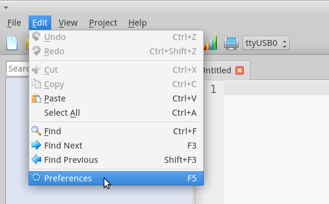
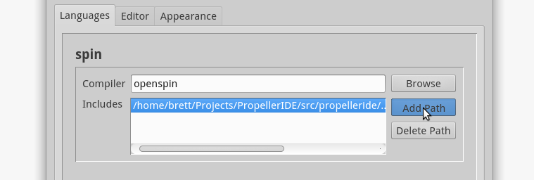
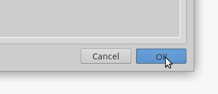
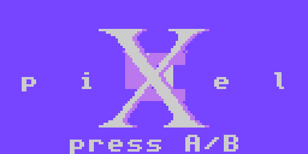
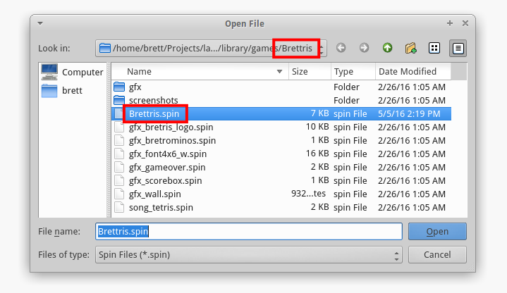
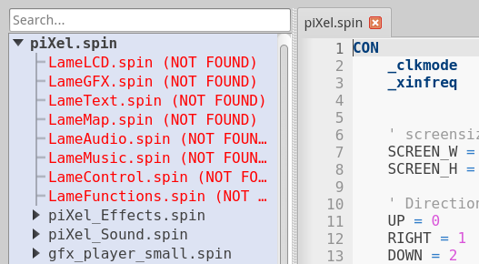

= Getting Started
:experimental:

To work with the LameStation, we have the LameStation SDK. An SDK, or *software development kit*, is a set of tools that are designed to use with a certain hardware platform--in this case, the LameStation gaming handheld.

- Device-specific libraries
- Programming tools
- Content creationg tools
- Media resources

We need to set up the LameStation SDK before we can do anything.

== Installing the SDK

. First, download and install the IDE for your platform:
+
link:http://developer.parallax.com/propelleride/[`developer.parallax.com/propelleride`]

. Then, download the latest SDK release:
+
link:https://github.com/lamestation/lamestation-sdk/releases/latest[`www.lamestation.com/sdk`]

. Unpack the SDK to a directory of your choosing.

. Open PropellerIDE and go to "_Edit -> Preferences_".
+
[NOTE]
On OS X, _Preferences_ falls under _PropellerIDE_, not _Edit_.
+

. Click the _Languages_ tab, and under _Includes_ in the _Spin_ box, and click _Add Path_ to add the location of the unpacked SDK.

. Hit _OK_!
+

PropellerIDE should now be set up for use with the LameStation.

== Testing

We can verify that the LameStation is working by loading a game from the `games/` directory of the SDK. Let's start by opening `games/piXel/piXel.spin` and pressing kbd:[F10] to download.

If it worked, you should see this screen.

If you'd like to try a different game, they follow a simple naming convention: in a folder named `AwesomeGame/`, the game is named `AwesomeGame.spin`.

[NOTE]
You can only have one game loaded at a time.

== Troubleshooting

[qanda]
====
I'm getting lots of _'NOT FOUND'_ messages. What's the deal? ::
Looks like you haven't set up the library path correctly. Make sure you properly added the SDK.

====
